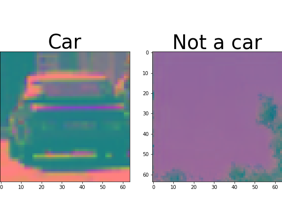
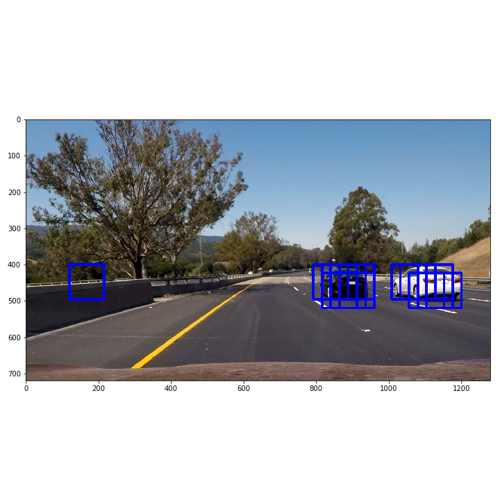
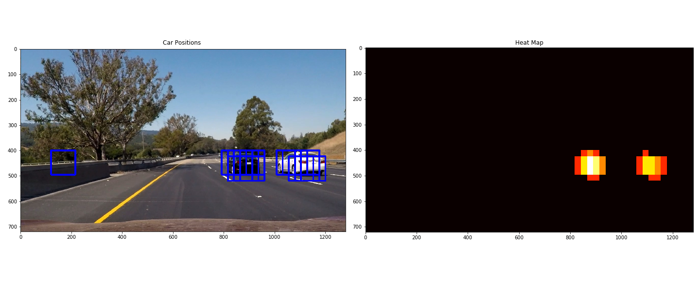

This repository contains a computer vision and traditional machine learning (i.e. not deep learning) solution to vehicle detection and tracking from dash cam footage in a self driving car. 

---
### Training a Classifier

This project uses training images from a combination of the [GTI vehicle image database](http://www.gti.ssr.upm.es/data/Vehicle_database.html) and the [KITTI vision benchmark suite](http://www.cvlibs.net/datasets/kitti/). You can download the data sets for [vehicles](https://s3.amazonaws.com/udacity-sdc/Vehicle_Tracking/vehicles.zip) and [non-vehicles](https://s3.amazonaws.com/udacity-sdc/Vehicle_Tracking/non-vehicles.zip) if you want to reimplement this project.  

Sample Image :

<figure>

<figcaption>- 64x64 image of a car.</figcaption>
</figure>

A convolutional neural network could learn to detect cars like this pretty easily in an image. It does that by breaking an image down into small convolutions which generate edges. These edges ensemble into shapes and so on. Used 3 different feature extraction methods, but first let's convert every image to **the YCrCb color space**.

<figure>

<figcaption> - Training datum in YCrCb.</figcaption>
</figure>

#### Histogram of color
This is exactly what you think! Just tally up the values for each color channel across the X-axis. This is useful thinking about a car, but it can lead to false positives if it's the only feature.

#### Spatially Binned Colors
Another quick and easy feature vector, spatially binned color takes an image, resizes it to a smaller size, then unravels it row by row into a one-dimensional vector. The image loses resolution and segments of the image with similar X values in the image will have the same pixel value in the feature vector.

#### Histogram of Oriented Gradients
HOG takes an image and breaks it down into a grid. Then, in each cell of the grid, every pixel has its gradient direction and magnitude computed. Those gradients are then but into a histogram with a number of bins for possible directions, however gradients with larger magnitudes contribute more than smaller magnitudes. 

#### Linear SVM
Now that we have a feature vector for image, we can train a classifier on the training data.
---
### Searching Within a Frame
Next is the task of using the classifier to identify cars within a frame of dash cam footage. I used a **sliding search window** approach for this. 

<figure>

<figcaption>The output from the LinearSVM.</figcaption>
</figure>

---
### Heatmaps
The image above shows multiple detections for each car and a false positive. In order to output a nice, smooth video overlay, we need to track our detections across multiple frames. Heatmaps are an ingenius and simple way to do this. 

<figure>

<figcaption>Heatmaps can track detections across multiple frames.</figcaption>
</figure>

---
### Summary
This project is mostly a showcase of the power of being explicit. Often times we think of deep learning as a cure-all, but there are situations where explicit computer vision is much better and traditional machine learning is much faster. This project has a very fast backend, but the drawing of bounding boxes, radius, etc (the image editing) is very slow.Further, this pipeline is not robust enough to handle the driving conditions that it needs to in order to be useable:
  1. Going uphill or downhill
  2. Rain/snow/etc
  3. Poor lighting conditions
  4. Roads that have little or no lane markers
  5. Occlusion by vehicles/signs/etc
